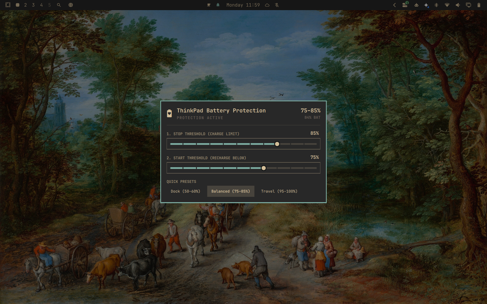

# ThinkPad Battery Protection

An **Omarchy** plugin built specifically for **Lenovo ThinkPads**, providing intuitive, fine-grained control over both **battery charge thresholds** (*Dual-Threshold Protection*).



---

## Why ThinkPad Battery Protection?

Most modern laptops only support a single charge stop limit (e.g., 80%). ThinkPads natively support two hardware thresholds via their Embedded Controller (EC):

1. **Stop Threshold (Charge Limit):** The battery stops charging when it reaches this value.
2. **Start Threshold (Recharge Below):** The battery only starts drawing power from the adapter once it drops below this value.

This eliminates the micro charge cycles that occur when the laptop stays plugged in all day, significantly extending the long-term health of the lithium cells.

---

## Features

- **Two Dynamic Sliders:**
  - **Stop Threshold:** 45% to 100% (in 5% steps).
  - **Start Threshold:** 40% to 95% (in 5% steps).
- **Smart Anti-Error Logic (Constraint Synchronization):**
  - The ThinkPad firmware requires `Start < Stop` at all times.
  - Dragging Stop down automatically lowers Start to maintain the safe margin.
  - Dragging Start up automatically raises Stop accordingly.
  - It is impossible to apply an invalid state to the hardware.
- **Natural Language Feedback:** Displays in real time what the ThinkPad will do (e.g., *"Charges to 85%, recharges below 75%"*).
- **Quick Presets with One Click:**
  - **Dock (50–60%):** Maximum preservation for laptops mostly plugged into a dock.
  - **Balanced (75–85%):** Great balance of daily runtime and battery longevity.
  - **Travel (95–100%):** Full charge on demand for trips away from the desk.
- **Full Omarchy Integration:**
  - Open from the Omarchy menu (**Trigger → Hardware → ThinkPad Battery Protection**).
  - Floating, centered overlay — no bar icon required.
  - Systemd service automatically restores thresholds after reboot.

---

## Supported Devices

### Lenovo ThinkPads (Dual Threshold: Start + Stop)

ThinkPad Battery Protection is designed for ThinkPads that expose both
`charge_control_start_threshold` and `charge_control_end_threshold` via the
`thinkpad_acpi` kernel driver. In general, **all ThinkPads from the Sandy Bridge
generation (2011) onwards** are supported.

| Series | Example Models | Dual Threshold |
|--------|---------------|:--------------:|
| **T-series** | T14, T14s, T16, T480, T490, T580 | ✅ |
| **X-series** | X1 Carbon, X1 Extreme, X1 Nano, X1 Yoga, X13 | ✅ |
| **P-series** | P14s, P15, P16, P50, P51, P52, P53, P72 | ✅ |
| **L-series** | L14, L15, L380, L390, L480, L490, L580 | ✅ |
| **E-series** | E14, E15, E16, E480, E490, E580 | ⚠️ Most work; some models report slightly different values due to EC firmware quirks — limits are still honored |
| **ThinkBook** | ThinkBook 14, 16 | ❌ Different EC; no dual threshold support |
| **Pre-2011 models** | T420, X220 and older | ❌ thinkpad_acpi does not expose sysfs thresholds |

### Other Brands (Stop Threshold Only)

The plugin gracefully degrades on non-ThinkPad hardware. When only a stop
threshold is available, the start slider is automatically hidden and only the
charge limit is shown.

| Brand | Driver | Stop Threshold | Start Threshold |
|-------|--------|:--------------:|:---------------:|
| **ASUS** (VivoBook, ROG, ZenBook) | `asus_wmi` | ✅ | ❌ |
| **Framework** | `cros_ec` | ✅ (BIOS ≥ 3.04) | ❌ |
| **Dell** (XPS, Latitude) | `dell_smm` / SMBIOS | ✅ (varies) | ❌ |
| **Huawei MateBook** | `huawei_wmi` | ✅ | ⚠️ Some models |
| **Samsung** | `samsung_laptop` | ⚠️ Limited | ❌ |
| **LG Gram** | `lg_laptop` | ⚠️ Limited | ❌ |
| **System76** | `system76` | ✅ | ❌ |
| **Tuxedo** | `tuxedo_*` | ✅ | ❌ |
| **MSI** | — | ❌ | ❌ |
| **Sony** | — | ❌ | ❌ |

### How to Check Your Device

```bash
ls /sys/class/power_supply/BAT*/charge_control_*threshold
```

- **Two files** (`start` + `end`) → full dual-threshold support.
- **One file** (`end` only) → stop-only mode, start slider will be hidden.
- **No files** → your hardware does not expose charge control to the kernel.

### Found an Issue?

If your device is listed as compatible but behaves unexpectedly, or if you
successfully use this plugin on a device not listed above, please
[open an issue](https://github.com/jesseburlamaque/thinkpad-battery-protection/issues)
so we can update this table and improve the plugin for everyone.

---

## Installation

### Quick Install (Recommended)

Run this single command in your terminal to install and configure everything in one step:

```bash
omarchy plugin add https://github.com/jesseburlamaque/thinkpad-battery-protection.git --enable && ~/.config/omarchy/plugins/jesseburlamaque.thinkpad-battery-protection/install.sh
```

### Manual / Development Install

If you prefer to clone the repository manually:

```bash
git clone https://github.com/jesseburlamaque/thinkpad-battery-protection.git
cd thinkpad-battery-protection
./install.sh
```

### Transparency: What does install.sh do?

Battery charge thresholds operate directly on the Linux kernel hardware interface (`/sys/class/power_supply/BAT*/`), which requires elevated privileges to modify. Because Omarchy's `omarchy plugin add` intentionally never executes privileged code during download, `install.sh` handles system configuration with explicit user authentication:

| Component | Destination | Purpose |
|---|---|---|
| **Helper scripts** | `/usr/local/libexec/tbp-helper`<br>`/usr/local/libexec/tbp-set` | Reads and writes threshold values to sysfs; verifies that callers originate from the authenticated desktop shell. |
| **Systemd service** | `/etc/systemd/system/thinkpad-battery-protection.service` | Automatically restores your saved charge thresholds whenever the computer starts or reboots. |
| **Polkit rule** | `/etc/polkit-1/rules.d/49-thinkpad-battery-protection.rules` | Authorizes the panel to adjust charge limits smoothly without asking for a password on every slider movement. |
| **Configuration** | `/etc/thinkpad-battery-protection.conf` | Stores your preferred start and stop thresholds across reboots. |
| **Menu entry** | `~/.config/omarchy/extensions/omarchy-menu.jsonc` | Adds the shortcut under **Trigger → Hardware → ThinkPad Battery Protection**. |

---

## Usage

- **Open the graphical interface:**
  ```bash
  omarchy-shell jesseburlamaque.thinkpad-battery-protection open
  ```
  *(Or open from the menu: Trigger → Hardware → ThinkPad Battery Protection)*

- **Check status from the terminal:**
  ```bash
  /usr/local/libexec/tbp-helper status
  ```

- **Set thresholds from the terminal (as root):**
  ```bash
  sudo /usr/local/libexec/tbp-helper set <STOP> <START>
  # Example:
  sudo /usr/local/libexec/tbp-helper set 85 75
  ```

---

## Uninstallation

To completely remove the plugin and all system components:

```bash
~/.config/omarchy/plugins/jesseburlamaque.thinkpad-battery-protection/uninstall.sh
omarchy plugin remove jesseburlamaque.thinkpad-battery-protection
```

This disables and removes the systemd service, deletes the Polkit rule and helper scripts from `/usr/local/libexec`, cleans up the menu entry, and unregisters the plugin from Omarchy.

---

## License

MIT License.

